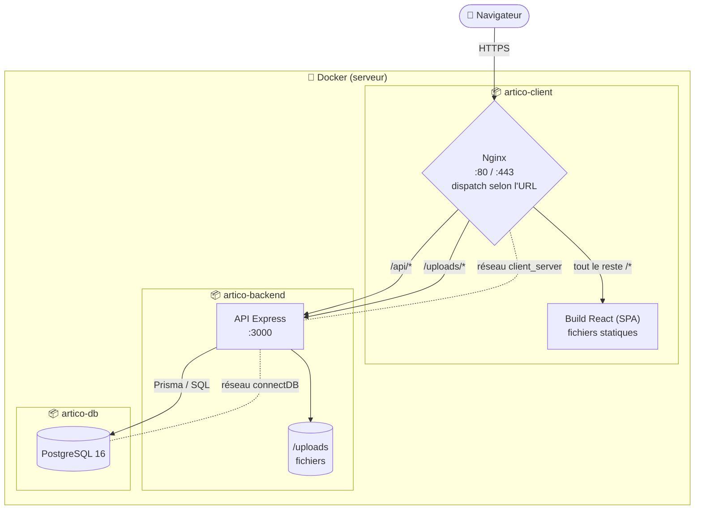
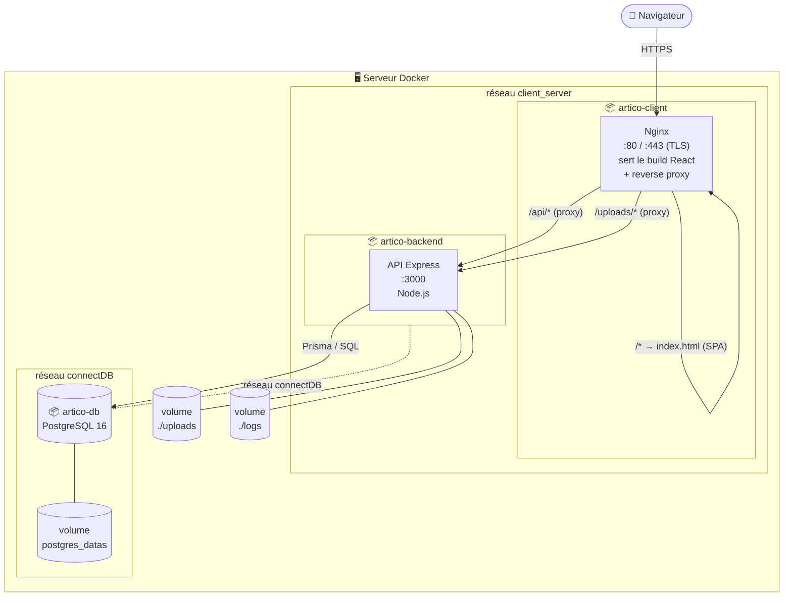
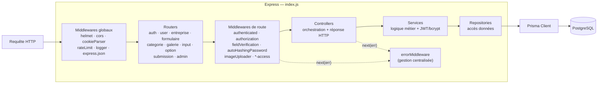
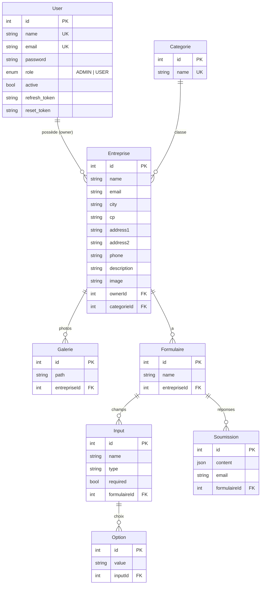
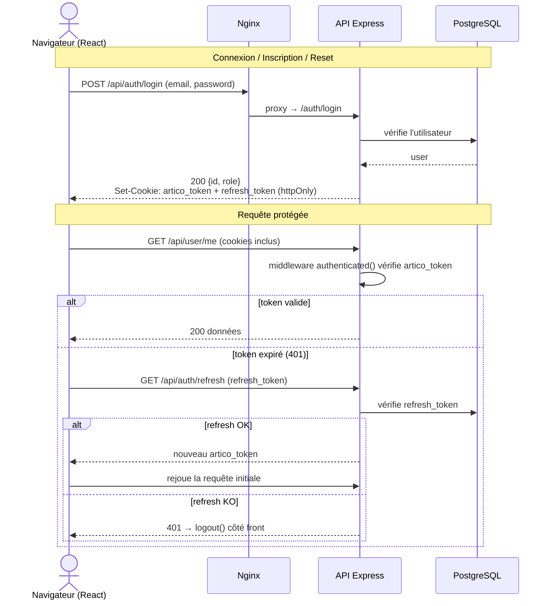
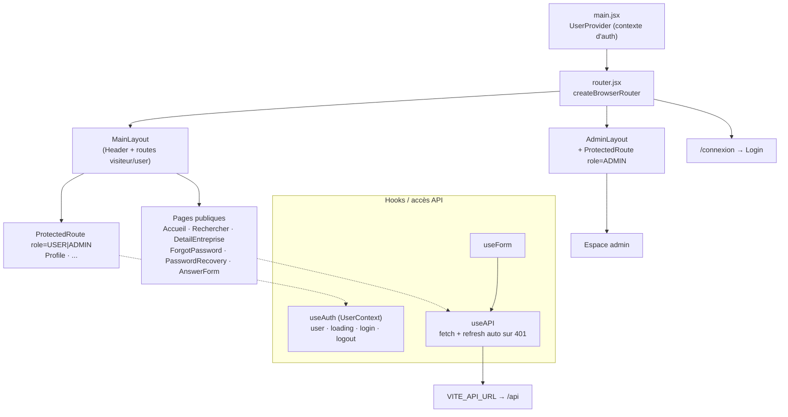

# Architecture — ArtiCo

Schémas Mermaid de l'architecture du projet (vue d'ensemble, conteneurs, couches API, modèle de données, flux d'authentification).

---

## 0. Vue d'ensemble — routage Nginx

Nginx est le **point d'entrée unique**. Il reçoit toutes les requêtes et les dispatche :
- `/api/*` et `/uploads/*` → **reverse proxy** vers le backend Express ;
- tout le reste → **fichiers statiques du front** React (avec fallback SPA `index.html`).

Le tout tourne dans des conteneurs Docker reliés par des réseaux dédiés.

---

## 1. Architecture de déploiement (production)

> En **dev**, le conteneur `client` lance le serveur Vite (`:5173`) avec un proxy vers `backend:3000`, et la DB expose son port `5432` sur l'hôte. Le hot-reload est assuré par les volumes `./API` et `./Frontend` montés dans les conteneurs.

---

## 2. Architecture en couches de l'API (backend)

---

## 3. Modèle de données (Prisma / PostgreSQL)

---

## 4. Flux d'authentification (JWT par cookies)

---

## 5. Frontend (SPA React + Vite)

---

> Le fichier se rend directement dans GitHub, GitLab, VS Code (aperçu Markdown) et tout viewer compatible Mermaid.
