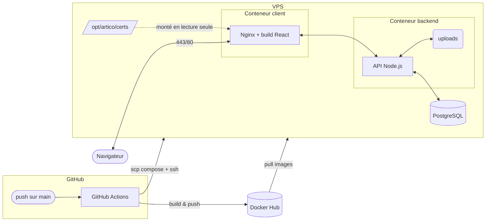

# ArtiCo

Application web permettant à des artisans de référencer leur(s) entreprise(s) et de proposer des questionnaires à de potentiels prospects / futurs clients.

- **Frontend** : React (Vite)
- **Backend** : Node.js / Express (API REST)
- **Base de données** : PostgreSQL (via Prisma)
- **Infrastructure** : Docker, images publiées sur Docker Hub, reverse proxy Nginx (dans le conteneur client), déploiement automatisé via GitHub Actions.

---

## Sommaire

- [Architecture](#architecture)
- [Structure Docker du dépôt](#structure-docker-du-dépôt)
- [Variables d'environnement](#variables-denvironnement)
- [Environnement de développement](#environnement-de-développement)
- [Intégration continue (CI)](#intégration-continue-ci)
- [Déploiement (CD)](#déploiement-cd)
  - [Vue d'ensemble du pipeline](#vue-densemble-du-pipeline)
  - [Secrets GitHub requis](#secrets-github-requis)
  - [Première mise en place du VPS](#première-mise-en-place-du-vps)
  - [Migrations et seed](#migrations-et-seed)
  - [Déclenchement manuel et rollback](#déclenchement-manuel-et-rollback)
- [Maintenance](#maintenance)
- [Dépannage](#dépannage)

---

## Architecture

En production, **Nginx tourne à l'intérieur du conteneur client** : il sert le build statique du frontend, termine le TLS (HTTPS) et fait office de reverse proxy vers l'API (`/api` et `/uploads`). Il n'y a donc **pas de Nginx ni de build à installer sur l'hôte** — le serveur n'a besoin que de Docker.



---

## Structure Docker du dépôt

| Fichier | Rôle |
|--|--|
| `docker-compose.yaml` | **Développement** : hot reload front (Vite) + back (`node --watch`), base de données locale. |
| `docker-compose.prod.yaml` | **Build** des images de production en local (utilisé aussi en CI pour valider le build). |
| `docker-compose.deploy.yaml` | **Déploiement sur le VPS** : tire les images depuis Docker Hub (aucun build sur le serveur). |
| `docker/backend/Dockerfile` · `Dockerfile.prod` | Images backend (dev / prod). |
| `docker/frontend/Dockerfile` · `Dockerfile.prod` | Images client (dev = serveur Vite, prod = build + Nginx). |
| `docker/backend/dev.sh` · `production.sh` | Entrypoints backend (migrations + seed + démarrage). |
| `nginx/nginx.conf` · `nginx.prod.conf` | Configurations Nginx (dev / prod). |

---

## Variables d'environnement

Toutes les variables sont centralisées dans un unique fichier `.env` à la racine (voir `.env.example`).

| Variable | Description |
|--|--|
| `DB_PASSWORD` | Mot de passe PostgreSQL |
| `DB_USER` | Utilisateur PostgreSQL |
| `DB_NAME` | Nom de la base |
| `DB_PORT` | Port exposé de la base (hôte) |
| `DB_HOST` | Hôte de la base (`db` en conteneur) |
| `DATABASE_URL` | URL de connexion Prisma |
| `MONGO_USER` / `MONGO_PASSWORD` / `MONGO_DB` | Identifiants et base MongoDB (logs) |
| `MONGO_PORT` / `MONGO_HOST` | Port (hôte) et hôte de MongoDB (`logs-db` en conteneur) |
| `MONGO_URL` | URL de connexion Mongoose à la base de logs |
| `PORT` | Port de l'API (3000) |
| `OWNER_EMAIL` / `OWNER_NAME` / `OWNER_PASSWORD` | Compte propriétaire créé par le seed |
| `APP_EMAIL` | Adresse d'envoi des mails |
| `GOOGLE_APP_PASSWORD` | Clé d'application Gmail (SMTP) |
| `SECRET_KEY` / `REFRESH_KEY` / `RESET_KEY` | Clés de signature JWT (access / refresh / reset) |
| `ACCESS_EXPIRACY` / `REFRESH_EXPIRACY` | Durées de vie des tokens |
| `PASSWORD_SALT` | Sel de hachage des mots de passe |
| `FRONTEND_URL` | Origine autorisée par CORS (ex : `https://valentinneff.dev`) |
| `VITE_API_URL` | URL de l'API côté front (`/api`) |
| `NODE_ENV` | `dev` ou `production` (active les cookies `secure` + `SameSite=None` en prod) |
| `LOCAL_PORT` / `LOCAL_PORT_SSL` | Ports publiés en local |
| `HOSTNAME` | Adresse de bind du serveur Node (`0.0.0.0` en conteneur) |

> En production, le pipeline ajoute automatiquement `DOCKERHUB_USERNAME` et `IMAGE_TAG` au `.env` du VPS pour résoudre le nom et le tag des images à tirer.

---

## Environnement de développement

Prérequis : **Docker** et **Docker Compose**.

```bash
cp .env.example .env   # puis renseigner les valeurs
docker compose up --build
```

| Service | URL / port |
|--|--|
| Frontend (Vite, hot reload) | `http://localhost:${LOCAL_PORT}` |
| API | `http://localhost:${PORT}` (proxifiée derrière `/api`) |
| PostgreSQL | `localhost:${DB_PORT}` |

- Le front et l'API se rechargent automatiquement à chaque modification (volumes montés + `node --watch` + HMR Vite).
- Le serveur Vite proxifie `/api` et `/uploads` vers le backend : pas de souci de CORS, le navigateur ne parle qu'à une seule origine.
- L'entrypoint dev (`dev.sh`) exécute `prisma migrate dev` puis `prisma db seed` au démarrage.

---

## Intégration continue (CI)

Workflow : `.github/workflows/ci.yml` — déclenché sur chaque **Pull Request** vers `develop` et `main`.

| Job (status check) | Action |
|--|--|
| `Tests API (Jest)` | `npm test` dans `API/` |
| `Build Frontend (Vite)` | `npm run build` dans `Frontend/` |
| `Build images de prod (build only, sans certs)` | `docker compose -f docker-compose.prod.yaml build` |

> Ces trois jobs sont configurés comme **status checks requis** dans une *branch ruleset* couvrant `main` et `develop` : une PR ne peut pas être mergée tant qu'ils ne passent pas.

---

## Déploiement (CD)

### Vue d'ensemble du pipeline

Workflow : `.github/workflows/deploy.yml` — déclenché sur **push vers `main`** (ou manuellement via *workflow_dispatch*).

1. **`Tests API (Jest)`** — relance les tests ; un échec stoppe tout le déploiement.
2. **`Build & push images (Docker Hub)`** — construit les images de prod backend (`docker/backend/Dockerfile.prod`) et client (`docker/frontend/Dockerfile.prod`, avec `VITE_API_URL=/api`), puis les pousse sur Docker Hub taggées `latest` **et** `${{ github.sha }}`.
3. **`Copy compose file and script`** — copie via SCP `docker-compose.deploy.yaml` et `docker/backend/production.sh` vers `DEPLOY_PATH` sur le VPS.
4. **`Déploiement SSH`** — se connecte en SSH au VPS et exécute :
   - ajout de `DOCKERHUB_USERNAME` et `IMAGE_TAG` au `.env`,
   - `docker login`, puis `docker compose -f docker-compose.deploy.yaml pull`,
   - arrêt des anciens conteneurs, `up -d`, `docker logout`, `docker image prune -f`.

### Secrets GitHub requis

À renseigner dans **Settings → Secrets and variables → Actions** :

| Secret | Rôle |
|--|--|
| `DOCKERHUB_USERNAME` | Namespace Docker Hub |
| `DOCKERHUB_TOKEN` | Token d'accès Docker Hub (push/pull) |
| `SSH_HOST` | Adresse du VPS |
| `SSH_USER` | Utilisateur SSH |
| `SSH_PRIVATE_KEY` | Clé privée SSH |
| `SSH_PORT` | Port SSH |
| `DEPLOY_PATH` | Dossier de déploiement sur le VPS (ex : `/opt/artico`) |

### Première mise en place du VPS

Le serveur n'héberge que Docker — aucune installation de Node, Nginx ou build n'est nécessaire.

**1. Installer Docker** ([documentation officielle](https://docs.docker.com/engine/install/ubuntu/)) et l'activer au démarrage :

```bash
sudo systemctl enable docker
```

**2. Ouvrir le pare-feu** (HTTP, HTTPS, SSH) :

```bash
sudo ufw allow 80
sudo ufw allow 443
sudo ufw allow 22 # (ou autre selon la configuration de votre serveur)
sudo ufw enable
```

**3. Préparer le dossier de déploiement** (`DEPLOY_PATH`, ex : `/opt/artico`) avec un fichier **`.env` de production** contenant toutes les variables ci-dessus, avec notamment :

```bash
NODE_ENV=production
DB_HOST=db
DATABASE_URL=postgresql://<user>:<password>@db:5432/<dbname>
FRONTEND_URL=https://mondomaine.fr
VITE_API_URL=/api
```

**4. Fournir les certificats TLS.** Le conteneur client monte `/opt/artico/certs` en lecture seule (cf. `docker-compose.deploy.yaml`) et Nginx y attend `fullchain.pem` et `privkey.pem`. On les génère avec certbot :

```bash
sudo apt install certbot
sudo certbot certonly --standalone -d mondomaine.fr -d www.mondomaine.fr
sudo mkdir -p /opt/artico/certs
sudo cp /etc/letsencrypt/live/mondomaine.fr/fullchain.pem /opt/artico/certs/
sudo cp /etc/letsencrypt/live/mondomaine.fr/privkey.pem  /opt/artico/certs/
```

Une fois ces étapes faites, **chaque push sur `main` déclenche le déploiement complet** automatiquement.

### Migrations et seed

L'entrypoint de production (`docker/backend/production.sh`) exécute à **chaque démarrage** du conteneur backend :

```sh
npx prisma generate
npx prisma migrate deploy   # applique les migrations en attente
npx prisma db seed          # crée le compte propriétaire si absent ainsi que la catégorie "Autre" par défaut
node index.js
```

Les migrations de base de données sont donc appliquées automatiquement à chaque déploiement.

### Déclenchement manuel et rollback

- **Manuel** : onglet *Actions → Deploy → Run workflow*.
- **Rollback** : sur le VPS, fixer le tag de l'image précédente puis relancer :

  ```bash
  cd "$DEPLOY_PATH"
  sed -i 's/^IMAGE_TAG=.*/IMAGE_TAG=<sha_precedent>/' .env
  docker compose -f docker-compose.deploy.yaml pull
  docker compose -f docker-compose.deploy.yaml up -d
  ```

  (chaque build pousse une image taggée avec le SHA du commit, ce qui permet de revenir à n'importe quelle version.)

---

## Maintenance

### Mettre à jour l'application

Aucune action manuelle : un merge / push sur `main` relance le pipeline qui reconstruit, republie et redéploie les images.

### Renouvellement du certificat SSL

Les certificats Let's Encrypt expirent au bout de 3 mois. Comme Nginx tourne dans le conteneur, après renouvellement il faut recopier les certificats dans `/opt/artico/certs` puis recharger Nginx du conteneur :

```bash
sudo certbot renew
sudo cp /etc/letsencrypt/live/mondomaine.fr/{fullchain,privkey}.pem /opt/artico/certs/
docker exec artico-client nginx -s reload
```

Automatisable via un *deploy-hook* certbot. Dans `/etc/letsencrypt/renewal/mondomaine.conf` :

```ini
renew_hook = cp /etc/letsencrypt/live/mondomaine.fr/fullchain.pem /etc/letsencrypt/live/mondomaine.fr/privkey.pem /opt/artico/certs/ && docker exec artico-client nginx -s reload
```

### Consulter les logs

```bash
docker logs artico-backend
docker logs artico-client
```

L'API journalise ses accès et ses erreurs sous forme de **documents structurés dans MongoDB** (service `logs-db`, collection `logs`). Pour les consulter :

```bash
docker exec -it artico-logs-db mongosh -u "$MONGO_USER" -p "$MONGO_PASSWORD" \
  --authenticationDatabase admin "$MONGO_DB" \
  --eval "db.logs.find().sort({ createdAt: -1 }).limit(20).pretty()"
```

Chaque log contient notamment `type` (`access` / `error`), `method`, `url`, `status`, `responseTimeMs`, `message`, `stack`, `ip` et `userId`. Si MongoDB est indisponible, l'API bascule automatiquement sur un **repli fichier** (`/app/logs/access.log` et `/app/logs/error.log`) + la console, sans jamais faire échouer une requête.

> Sur le VPS, le `.env` de production doit contenir les variables `MONGO_*` (le pipeline ne copie que `docker-compose.deploy.yaml` et `production.sh`).

---

## Dépannage

**Les conteneurs ne démarrent pas / nom déjà utilisé**

```bash
docker ps -a
docker compose -f docker-compose.deploy.yaml up -d --remove-orphans
```

**Erreur de certificat / HTTPS indisponible** — vérifier que `fullchain.pem` et `privkey.pem` sont bien présents dans `/opt/artico/certs` et que les ports 80/443 sont ouverts (`sudo ufw status`).

**Les cookies ne sont pas transmis à l'API** — s'assurer que l'application est servie en **HTTPS** et que `NODE_ENV=production` (les cookies sont alors `Secure` + `SameSite=None`).

**Le déploiement reste bloqué / images non tirées** — vérifier les secrets `DOCKERHUB_*` et que le `.env` du VPS contient bien `DOCKERHUB_USERNAME` et `IMAGE_TAG` (ajoutés par le pipeline).
