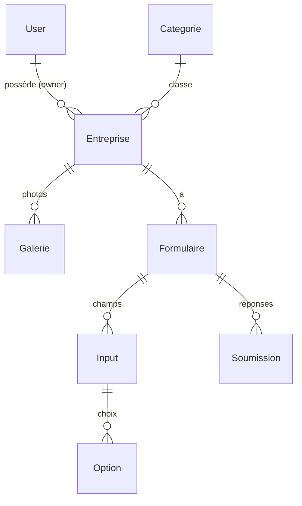

# Base de données — ArtiCo

L'application utilise **deux bases** :

- **PostgreSQL** — données métier, via **Prisma** (ORM).
- **MongoDB** — journalisation (accès / erreurs), via **Mongoose**.

> Voir aussi : [Architecture](./ARCHITECTURE.md) · [Guide Backend](./BACKEND.md) · [README racine](../README.md)

---

## PostgreSQL (Prisma)

### Fichiers

| Chemin | Rôle |
|--|--|
| `API/prisma/schema.prisma` | Schéma des modèles et relations |
| `API/prisma/migrations/` | Historique des migrations SQL |
| `API/prisma/seed.js` | Données initiales (compte propriétaire + catégorie « Autre ») |
| `API/prisma/generated/client/` | Client Prisma généré (`output` personnalisé) |
| `API/utils/client.js` | **Singleton** du client Prisma (adapter `@prisma/adapter-pg`) |

La connexion se fait via `DATABASE_URL` (voir les [variables d'environnement](../README.md#variables-denvironnement)).

### Modèle de données



| Modèle (table) | Description | Champs notables |
|--|--|--|
| **User** (`users`) | Comptes. `name` et `email` uniques. | `role` (`ADMIN`/`USER`), `active`, `refresh_token`, `reset_token`, `password` (haché) |
| **Entreprise** (`entreprises`) | Fiche d'un artisan. | `ownerId` → User, `categorieId?` → Categorie, `image?` |
| **Categorie** (`categories`) | Domaine d'activité. `name` unique. | — |
| **Formulaire** (`formulaires`) | Questionnaire d'une entreprise. | `entrepriseId` |
| **Galerie** (`galeries`) | Photos d'une entreprise. | `path`, `entrepriseId` |
| **Input** (`inputs`) | Champ d'un questionnaire. | `type` (défaut `text`), `required`, `formulaireId` |
| **Option** (`options`) | Choix d'un champ (select/radio…). | `value`, `inputId` |
| **Soumission** (`soumissions`) | Réponse à un questionnaire. | `content` (**JSON**), `email`, `formulaireId` |

### Relations et suppressions en cascade

Les suppressions sont en **cascade** depuis le haut de la hiérarchie (`onDelete: Cascade`) :

- supprimer un **User** supprime ses **Entreprise**s ;
- supprimer une **Entreprise** supprime ses **Galerie**s, **Formulaire**s ;
- supprimer un **Formulaire** supprime ses **Input**s et **Soumission**s ;
- supprimer un **Input** supprime ses **Option**s.

> `Entreprise.categorieId` est **nullable** et **sans cascade** : supprimer une catégorie ne supprime pas les entreprises (leur catégorie passe à `null`).

> ⚠️ La cascade SQL ne supprime **pas les fichiers** (images d'entreprise, photos de galerie). C'est le **service** qui s'en charge sur disque avant la suppression en base (cf. `entreprise-service.js`).

### Migrations

Les migrations sont **versionnées** dans `API/prisma/migrations/` et appliquées automatiquement au démarrage des conteneurs.

| Contexte | Commande | Quand |
|--|--|--|
| **Développement** | `npx prisma migrate dev` | créer une migration après modification du schéma |
| **Production** | `npx prisma migrate deploy` | appliquer les migrations en attente (exécuté par `production.sh`) |
| (génération client) | `npx prisma generate` | régénérer le client après changement de schéma |

> Les entrypoints Docker (`docker/backend/dev.sh` et `production.sh`) enchaînent `generate` → `migrate` → `db seed` → démarrage. Voir [README racine](../README.md#migrations-et-seed).

**Modifier le schéma** :

1. éditer `API/prisma/schema.prisma` ;
2. `npx prisma migrate dev --name <nom_explicite>` (crée le fichier de migration + applique en local) ;
3. committer le dossier de migration généré ;
4. en production, la migration s'applique seule au prochain déploiement.

### Seed (`prisma/seed.js`)

Idempotent (`upsert` / vérification d'existence) :

- crée/maintient le **compte propriétaire ADMIN** depuis `OWNER_EMAIL` / `OWNER_NAME` / `OWNER_PASSWORD` ;
- crée la **catégorie « Autre »** par défaut si absente.

```bash
npx prisma db seed
```

### Commandes utiles

```bash
cd API
npx prisma studio          # explorateur visuel de la base
npx prisma migrate status  # état des migrations
npx prisma validate        # valide le schéma
npx prisma format          # formate schema.prisma
```

---

## MongoDB (logs)

Base **séparée** dédiée à la journalisation, indépendante des données métier.

| Élément | Détail |
|--|--|
| Connexion | `API/utils/mongo.js` (`connectMongo`, `isMongoConnected`), via `MONGO_URL` |
| Modèle | `API/models/log-model.js` (collection `logs`) |
| Écriture | `API/utils/logStore.js` → `writeLog(doc)` |

Chaque document : `type` (`access`/`error`), `method`, `url`, `status`, `responseTimeMs`, `message`, `stack`, `ip`, `userId`, `createdAt`.

**Tolérance aux pannes** : si MongoDB est indisponible, `writeLog` bascule sur un **repli fichier** (`API/logs/access.log`, `API/logs/error.log`) + console, sans jamais faire échouer la requête HTTP.

Consultation : voir le [README racine](../README.md#consulter-les-logs).
