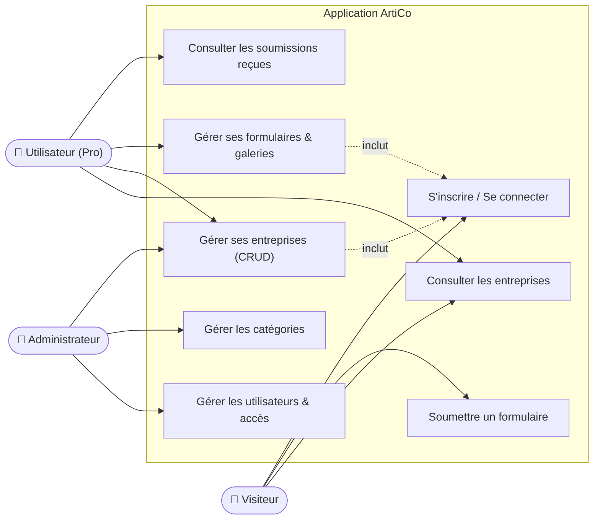
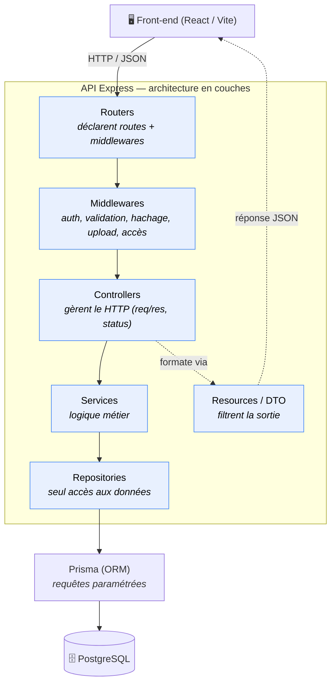
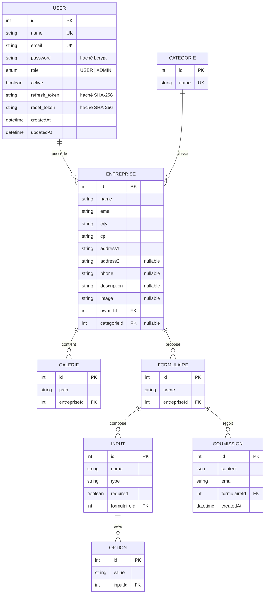
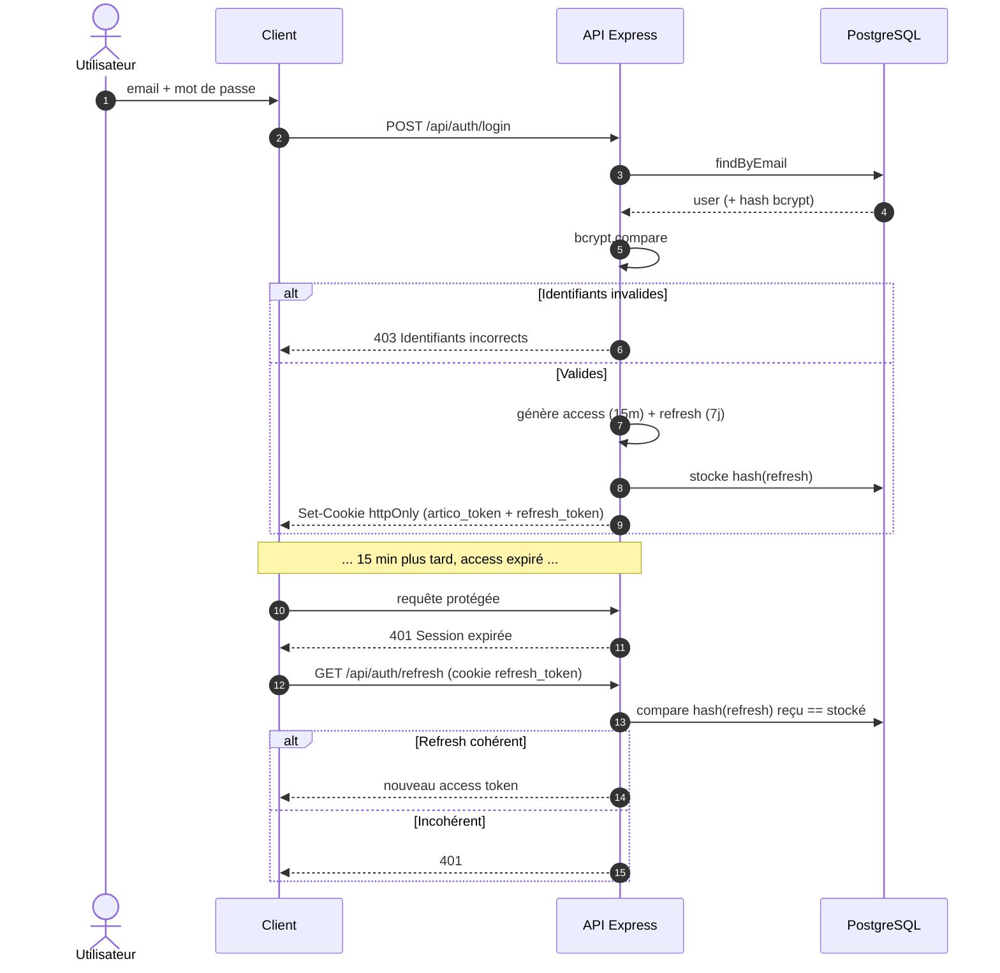
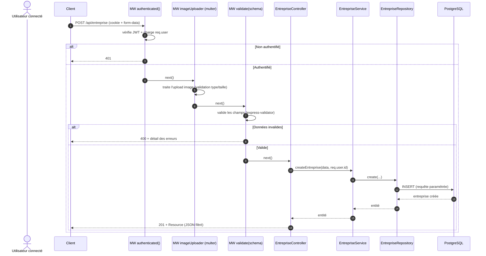
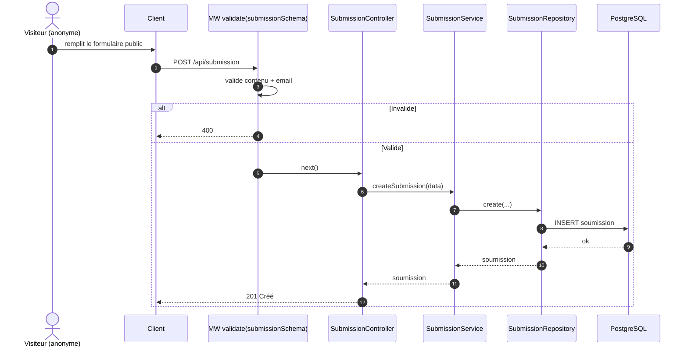
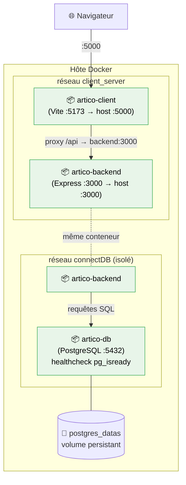
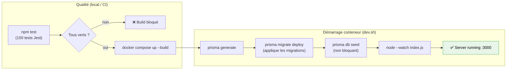
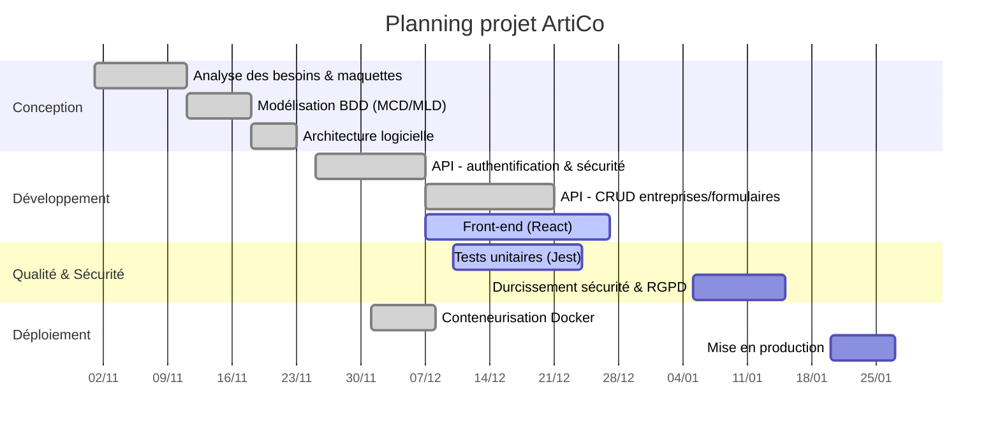

# Diagrammes du dossier CDA — Projet ArtiCo

Recueil des diagrammes (format **Mermaid**) couvrant tous les aspects du dossier
professionnel CDA, organisés selon les 3 blocs de compétences.

> **Comment les utiliser :**
> - Aperçu / export PNG-SVG : copier un bloc sur [mermaid.live](https://mermaid.live).
> - Dans VS Code : extension *Markdown Preview Mermaid Support*.
> - GitHub / GitLab rendent les blocs ` ```mermaid ` nativement.

## Sommaire

- **Bloc 2 — Concevoir**
  - [1. Diagramme de cas d'utilisation](#1-diagramme-de-cas-dutilisation)
  - [2. Architecture en couches](#2-architecture-en-couches)
  - [3. Modèle de données (MCD / entité-relation)](#3-modèle-de-données-mcd--entité-relation)
- **Bloc 1 — Développer**
  - [4. Séquence : authentification (login + refresh)](#4-séquence--authentification-login--refresh)
  - [5. Séquence : création d'entreprise (traversée des couches)](#5-séquence--création-dentreprise-traversée-des-couches)
  - [6. Séquence : soumission publique d'un formulaire](#6-séquence--soumission-publique-dun-formulaire)
  - [7. Pipeline de middlewares (cycle de vie d'une requête)](#7-pipeline-de-middlewares-cycle-de-vie-dune-requête)
- **Bloc 3 — Déployer**
  - [8. Architecture de déploiement (Docker)](#8-architecture-de-déploiement-docker)
  - [9. Pipeline de tests & démarrage conteneur](#9-pipeline-de-tests--démarrage-conteneur)
- **Gestion de projet**
  - [10. Planning (diagramme de Gantt)](#10-planning-diagramme-de-gantt)

---

## 1. Diagramme de cas d'utilisation

Acteurs et fonctionnalités principales de l'application.



> **À expliquer :** trois profils aux droits croissants. Le visiteur agit sans
> compte (consultation + soumission), l'utilisateur gère ses propres ressources
> (contrôle de propriété), l'administrateur a les droits transverses (rôle ADMIN).

---

## 2. Architecture en couches

Architecture multicouche de l'API : chaque couche a une responsabilité unique et
ne communique qu'avec la couche adjacente.



> **À expliquer :** couplage faible + responsabilité unique. Le contrôleur ne sait
> rien de la base ; le repository ne sait rien du métier. On peut changer une
> couche sans impacter les autres → maintenabilité et testabilité.

---

## 3. Modèle de données (MCD / entité-relation)

Schéma relationnel issu de `schema.prisma`. Les cardinalités traduisent les
relations et `onDelete: Cascade` garantit l'intégrité référentielle.



> **À expliquer :** modèle normalisé (3NF), contraintes d'unicité (`email`, `name`),
> clés étrangères et suppressions en cascade pour garantir qu'aucune donnée
> orpheline ne subsiste (important pour l'intégrité **et** le droit à l'effacement
> RGPD).

---

## 4. Séquence : authentification (login + refresh)

Cycle complet du double jeton JWT (access 15 min / refresh 7 j) en cookies `httpOnly`.



> **À expliquer :** access court = fenêtre d'exploitation réduite ; refresh stocké
> haché = révocable. `httpOnly` contre XSS, `sameSite: Strict` contre CSRF.

---

## 5. Séquence : création d'entreprise (traversée des couches)

Cas métier complet montrant le passage par **toutes les couches** et le pipeline
de middlewares (chaîne réelle de `entreprise-router.js`).



> **À expliquer :** la sécurité est posée *en amont* du contrôleur (auth →
> validation), donc une donnée non authentifiée ou malformée n'atteint jamais la
> logique métier. Chaque couche a un rôle unique.

---

## 6. Séquence : soumission publique d'un formulaire

Cas d'un **visiteur sans compte** (route `POST /api/submission` non authentifiée
mais validée).



> **À expliquer (et point RGPD) :** la soumission stocke des données d'un tiers
> (email + contenu). Pas d'authentification requise (formulaire public), mais
> validation stricte. Limite assumée : consentement et durée de conservation à
> ajouter.

---

## 7. Pipeline de middlewares (cycle de vie d'une requête)

Vue transversale : comment une requête traverse les middlewares globaux puis
spécifiques avant d'atteindre la logique, et comment les erreurs sont centralisées.

```mermaid
flowchart TD
    Req["Requête HTTP"] --> G1["express.json()"]
    G1 --> G2["cookieParser"]
    G2 --> G3["cors (origine restreinte)"]
    G3 --> G4["rateLimit (50/15min)"]
    G4 --> G5["helmet (en-têtes sécurité)"]
    G5 --> G6["logger (access.log)"]
    G6 --> RM{"Middlewares de route"}

    RM --> M1["authenticated()"]
    M1 --> M2["validate(schema)"]
    M2 --> M3["accès / upload / hachage"]
    M3 --> Ctrl["Controller → Service → Repository"]

    Ctrl -->|succès| Resp["Réponse JSON (Resource)"]
    M1 -->|échec| Err["error-middleware<br/>(error.log + réponse cohérente)"]
    M2 -->|échec| Err
    Ctrl -->|next(error)| Err
    Err --> Resp

    classDef global fill:#fff4e5,stroke:#f4a142,color:#000;
    classDef route fill:#e8f0fe,stroke:#4285f4,color:#000;
    class G1,G2,G3,G4,G5,G6 global;
    class M1,M2,M3 route;
```

> **À expliquer :** défense en profondeur (plusieurs barrières globales) +
> gestion d'erreur centralisée (un seul point de formatage/journalisation).

---

## 8. Architecture de déploiement (Docker)

Infrastructure conteneurisée : 3 services, 2 réseaux isolés, 1 volume persistant.



> **À expliquer :** le `client` ne parle qu'au `backend` ; seul le `backend` est
> sur le réseau de la base (cloisonnement → moindre exposition). `depends_on:
> service_healthy` garantit que la base est prête avant le démarrage du backend.
> Le volume assure la persistance des données entre redémarrages.

---

## 9. Pipeline de tests & démarrage conteneur

Séquence d'initialisation du backend (entrypoint `dev.sh`) et place des tests.



> **À expliquer :** `migrate deploy` (non-interactif) en conteneur vs `migrate dev`
> (local). Les tests unitaires servent de garde-fou de non-régression avant
> déploiement.

---

## 10. Planning (diagramme de Gantt)

Exemple de planning projet à adapter à tes dates réelles (le Gantt valorise la
compétence « contribuer à la gestion d'un projet »).



> ⚠️ Ajuste les dates à ton calendrier réel avant de l'intégrer au dossier.

---

## Récapitulatif — quel diagramme pour quel chapitre du dossier

| Chapitre du dossier | Diagramme(s) à inclure |
|---------------------|------------------------|
| Présentation fonctionnelle | 1 (cas d'utilisation) |
| Conception / architecture | 2 (couches), 8 (déploiement) |
| Base de données | 3 (entité-relation) |
| Réalisation / exemples de code | 4, 5, 6 (séquences), 7 (pipeline) |
| Sécurité | 4 (auth), 7 (middlewares) |
| Tests & déploiement | 9 (pipeline tests/boot), 8 (Docker) |
| Gestion de projet | 10 (Gantt) |

Ces diagrammes complètent les documents :
`securite-authentification-tokens.md` et `dossier-cda-api-securite.md`.
