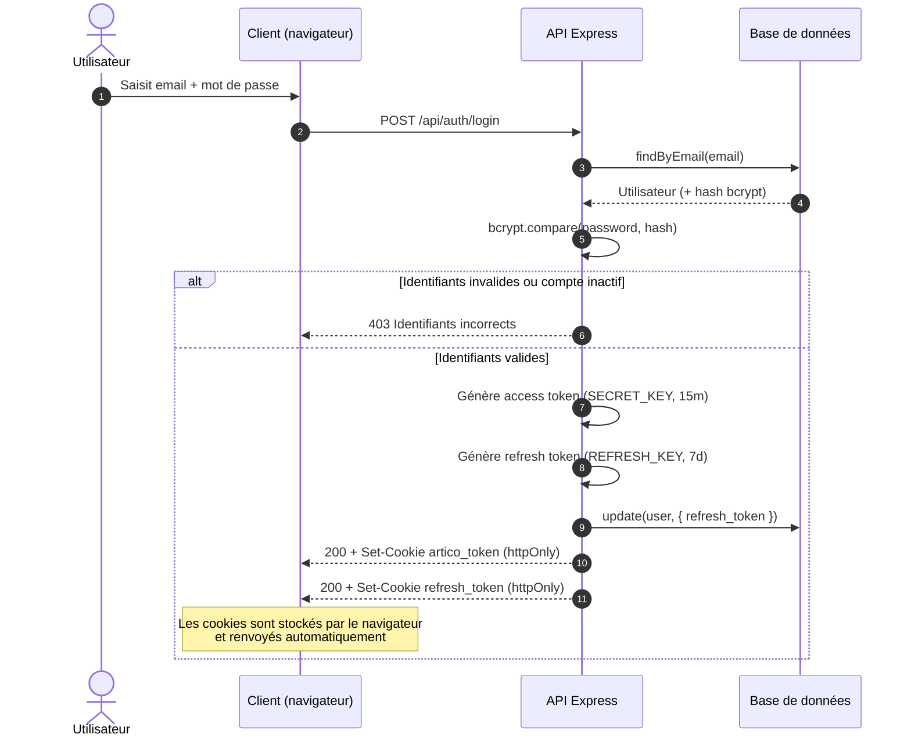
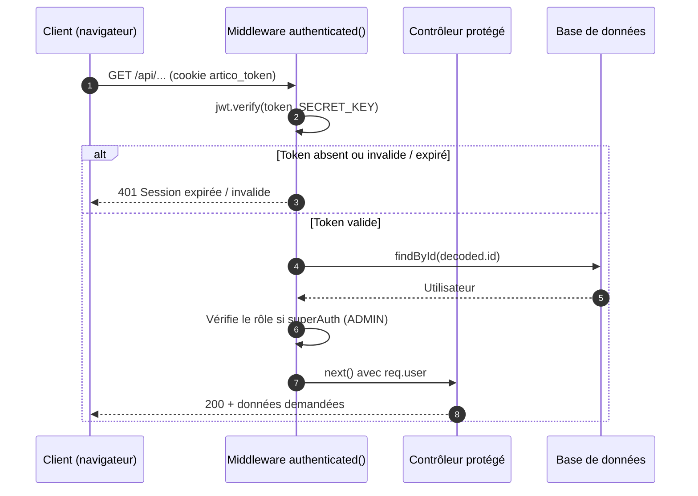
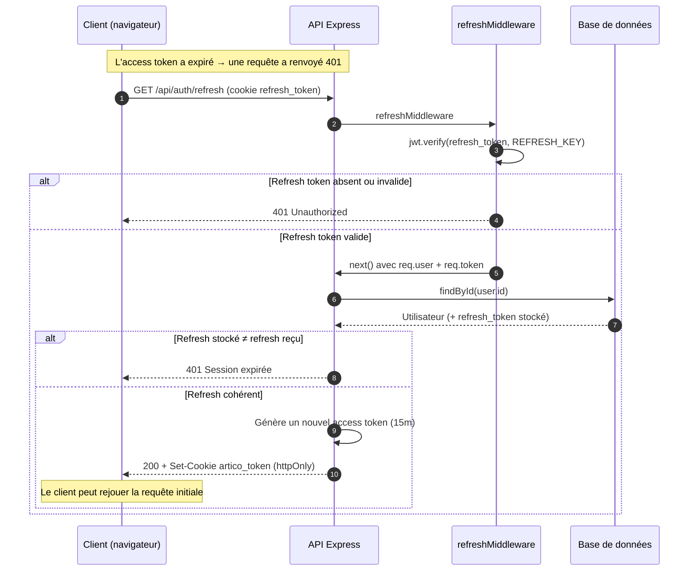
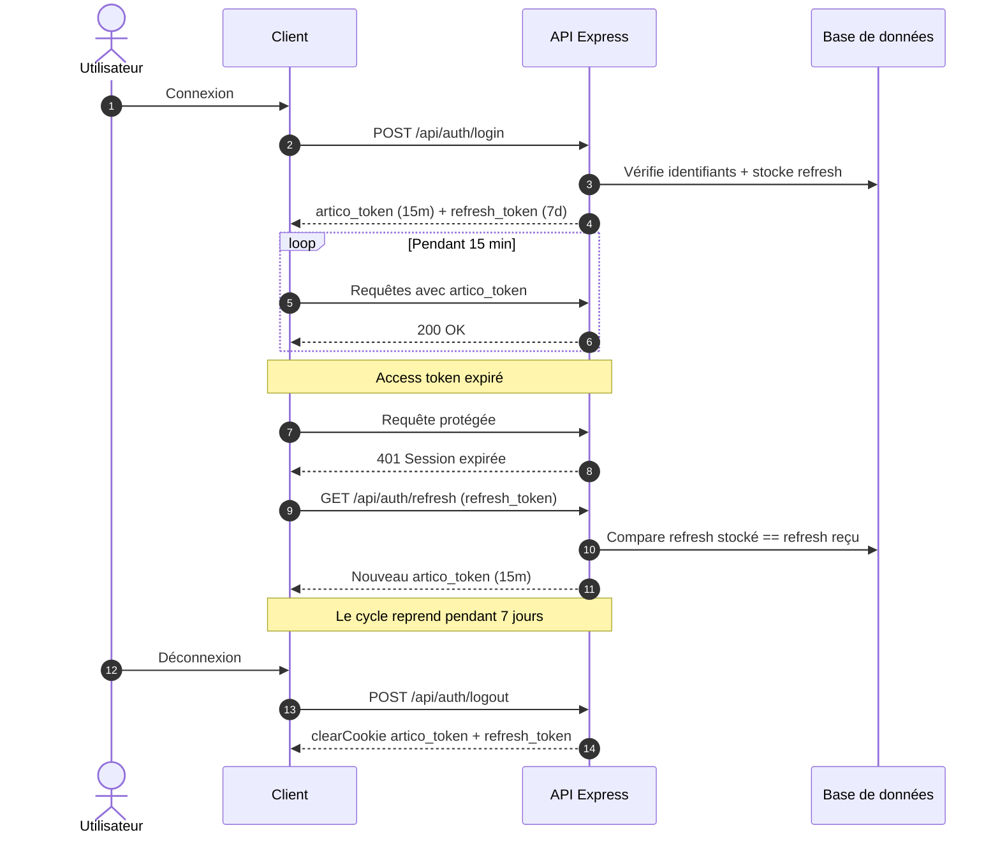

# Authentification — Access Token & Refresh Token

Documentation des flux d'authentification de l'API ArtiCo, basée sur un système
de **double jeton (JWT)** transmis via des **cookies `httpOnly`**.

| Jeton | Cookie | Durée de vie | Clé de signature | Rôle |
|-------|--------|--------------|------------------|------|
| Access token | `artico_token` | **15 min** | `SECRET_KEY` | Authentifie chaque requête protégée |
| Refresh token | `refresh_token` | **7 jours** | `REFRESH_KEY` | Régénère un access token sans re-login |

**Options des cookies** (`httpOnly`, `sameSite: Strict`, `secure` en production) :
- `httpOnly` → inaccessible au JavaScript : protège contre le **vol de jeton par XSS**.
- `sameSite: Strict` → protège contre les attaques **CSRF**.
- `secure` → cookie transmis uniquement en **HTTPS** (en production).

---

## 1. Connexion (login)

L'utilisateur s'authentifie : le serveur émet les deux jetons et les persiste.

---

## 2. Requête protégée avec access token valide

Cas nominal : l'access token n'est pas expiré.

---

## 3. Renouvellement (refresh) après expiration de l'access token

Quand l'access token est expiré (401), le client appelle `/refresh`.
Le refresh token est vérifié **et comparé à celui stocké en base** — ce qui
permet de **révoquer** une session.

---

## 4. Cycle de vie complet (vue d'ensemble)

---

## Points de sécurité à retenir

- **Séparation des responsabilités** : l'access token (courte durée) limite la
  fenêtre d'exploitation en cas de vol ; le refresh token (longue durée) évite
  de redemander le mot de passe.
- **Révocation possible** : le refresh étant stocké en base, régénérer ou
  supprimer cette valeur (ex. au changement de mot de passe) invalide toutes les
  sessions existantes.
- **Aucun jeton accessible au JavaScript** grâce à `httpOnly`.
- **Signatures distinctes** (`SECRET_KEY` ≠ `REFRESH_KEY`) : compromettre une
  clé ne compromet pas l'autre type de jeton.
